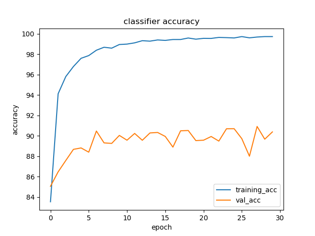
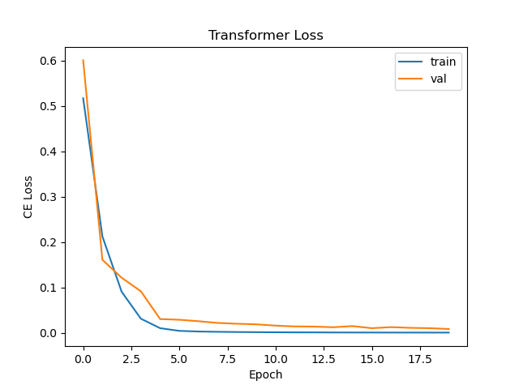

# chinese-ocr-webapp

### OCR webapp that uses YOLOv5 to detect chinese characters, ConvNet to classify detected characters, and Transformer network to translate Chinese to English. 

## Character Detection with YOLOv5
YOLOv5 achieved a 70.8 mAP after 100 epochs. \


## Character Classification with CNN 
best model: 90% accuracy on dev set after 20 epochs \


## Chinese to English Translation with Transformer 
best model - epoch: 40 val loss: 0.4836350381374359 bleu: 0.7384979341626325 \


## Example 
Input Image: \
 \
Output of YOLOv5: \
  \
Output of CNN: \
```['你', '好']```\
Output of Transformer: \
```Hi```


